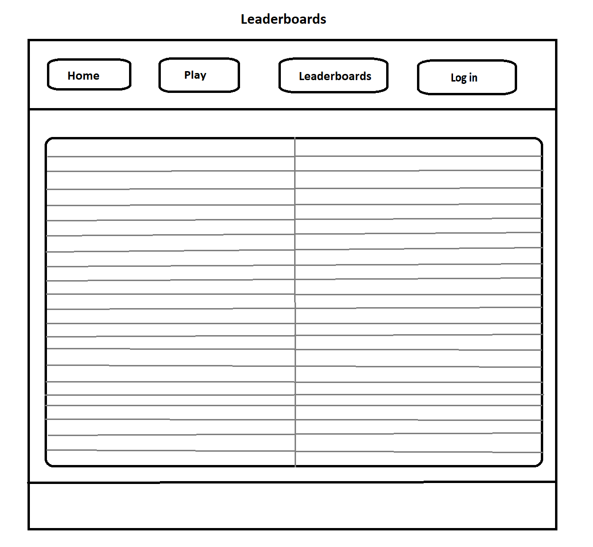

# GestureGalaxy
This site aims to satisfy your cravings for arcade-style gaming while at home on your computer. The site provides the game rock-paper-scissors-lizard-Spock, which was popularized by the TV show 'The Big Bang Theory.

## Table of contents 
- [Title](#title)
- [Design](#design)
- [Features](#features)
- [Testing](#testing)
- [Deployment](#deployment)
- [Credits and Outside Sources](#credits)

## Design
### Wireframes 
After i hade come up with a design idea i started to draw some wireframes on how i wanted it to look
#### Site Plan
This is the initial site plan

- I decided to not have a log in section because it didn´t make sense, since i couldnt store the accounts

#### Content Pages
After i had decided upon a sitemap i started mocking up some designs for the different content pages
This is the home/landing page:

- I wanted this page to display clear information about the page 
- I mostly kept the initial design for this page
This is the play/game page:

- I wanted this section to feel like an old gameboy system so i decided to make the game window itself look like a gameboy screen, and the move list to look like buttons.
This is the leaderboards page:

- I wanted this page to look like a tyoical leaderboard you would find in a online game. I also wanted it to update automatically after each game played with the name of the player.
- Initially this was supposed to be tied to the player accounts but i ended up changing it to an arcade style system where you get to enter your name after each game
This is the login page:

- I originally wanted this page to look like a form you filled in, but it has since been scrapped and replaced by the game rules page.
This is the game rules page:

- I only wanted this page to display clear information about the game rules, I did this via the picture i based the game upon

## Features 
### Existing Features
#### Main menu
The main menu contains all the links for the different pages on the site
This is a picture of the main menu

#### Dropdown menu
The dropdown menu is only accessible when on smaller screens, I did this to make it fit better.
This is a picture of the dropdown menu when it is closed:

This is a picture of the dropdown menu when it is open:

#### Game section
The game section is the main content and purpouse of the site. This is where you actually play the game.
When you first open this page you are met with a start window that tells you to press it to start the game.
This is a picture of start window:

When clicked it opens the game and you can start playing
This is a picture of the started game screen:

##### Hands 
At each side of the screen there are pictures of hands that change depending on what move was chosen.
The hands were designed by my friend Viktor
Empty hand picture

Rock hand sign picture

Paper hand sign picture

Scissors hand sign picture

Lizard hand sign picture

Spock hand sign picture

##### Movelist
The move list are your controls for the game, where you choose which move to make.
Picture of the movelist

##### Mute button
The mute button controlls the music in the game. You can either have it on or off. 
I used fas fa icons for this.
Picture of button when unmuted

Picture of button when muted

##### Scoreboard
The game keeps track of the player and computer scrores through a scoreboard.
Picture of the scoreboard

##### Result
After each round the game tells you who won.
Picture of player winning:

Picture of computer winning:

Picture of a tie:

##### Final result
Whenever the player or computer reaches a score of 3 they get met with a screen that announces who won the game
Picture of winning screen

##### Name input
If the player won the entire game you get to input a three character long name that ends up on the leaderboard.
I chose an arcade style font for this.
Picture of the name input screen 

Picture of font

##### Restart button
After each game you get met with a screen that says play again?
Picture of restart button:

#### Leaderboard section
The leaderboard is tied to the name you entered when winning the game. It keeps track of how many wins the name inputed has and each time they win it adds +1 to the score
Picture of the leaderboard

### Features Left to Implement
- Difficulty scaling 
- Online matches
## Testing 

In this section, you need to convince the assessor that you have conducted enough testing to legitimately believe that the site works well. Essentially, in this part you will want to go over all of your project’s features and ensure that they all work as intended, with the project providing an easy and straightforward way for the users to achieve their goals.

In addition, you should mention in this section how your project looks and works on different browsers and screen sizes.

You should also mention in this section any interesting bugs or problems you discovered during your testing, even if you haven't addressed them yet.

If this section grows too long, you may want to split it off into a separate file and link to it from here.

### Lighthouse tool 
I used the Lighthouse chrome extension to test my website. My initial score was:

My poor SEO was due to missing a <meta name="viewport" content="width=device-width, initial-scale=1.0"> string in my code.
After i added it my new score was

### Validator Testing 

- HTML
  - No errors were returned when passing through the official [W3C validator](https://validator.w3.org/nu/?doc=https%3A%2F%2Fcode-institute-org.github.io%2Flove-running-2.0%2Findex.html)
- CSS
  - No errors were found when passing through the official [(Jigsaw) validator](https://jigsaw.w3.org/css-validator/validator?uri=https%3A%2F%2Fvalidator.w3.org%2Fnu%2F%3Fdoc%3Dhttps%253A%252F%252Fcode-institute-org.github.io%252Flove-running-2.0%252Findex.html&profile=css3svg&usermedium=all&warning=1&vextwarning=&lang=en#css)

### Unfixed Bugs
- You can choose a move before the game is started

## Deployment
To deploy the project follow the following steps.

1. Copy/Clone the <a href="https://github.com/linusapelgren/GestureGalaxy" target="_blank">repository</a> on github.

2. Go to your copy of the repository on your github page (likely `https://github.com/YOUR-USERNAME-HERE/GestureGalaxy`)

3. Open settings tab on top right of page

4. Click on pages link on the left sidebar in the "Code and Automation" section.

5. Set "Source" to "Deploy from branch", select "main" branch, and set folder to /(root) under "Build and Deployment". Then click Save.

6. Return to the "Code" tab and wait for site to build. Try doing a hard refresh.

7. On the right hand side under "Deployments", click on "github-pages".

8. Click on the link which matches `https://USERNAME.github.io/REPO-NAME/` to view the deployed site.

[return to Table of Contents](#toc)

## Credits and outside sources

### Sound
For the sound effects on the website I used sound i found on these websites
- <a href="https://pixabay.com/sound-effects/search/ui/" target="_blank">Pixabay</a> 
- <a href="https://mixkit.co/free-sound-effects/win/" target="_blank">Mixkit</a> 

### Media
- <a href="https://www.instructables.com/How-to-Play-Rock-Paper-Scissors-Lizard-Spock/" target="_blank">Instructables</a> 
- <a href="https://sv.wikipedia.org/wiki/Game_Boy_%28original%29" target="_blank">Wikipedia</a> 

### External link 
- <a href="https://favicon.io/favicon-converter/" target="_blank">Online favicon generator</a> 
- <a href="https://ui.dev/amiresponsive" target="_blank">AmIResponsive</a>
- <a hraf="https://cdnjs.cloudflare.com/ajax/libs/font-awesome/5.15.3/css/all.min.css" target="_blank">Font-awesome</a>
- <a hraf="https://fonts.googleapis.com" target="_blank">Fonts.googleapis</a>
- <a hraf="https://fonts.gstatic.com" target="_blank">Fonts.gstatic</a>
- <a hraf="https://fonts.googleapis.com/css2?family=Press+Start+2P&display=swap" target="_blank">Fonts.googleapis</a>

